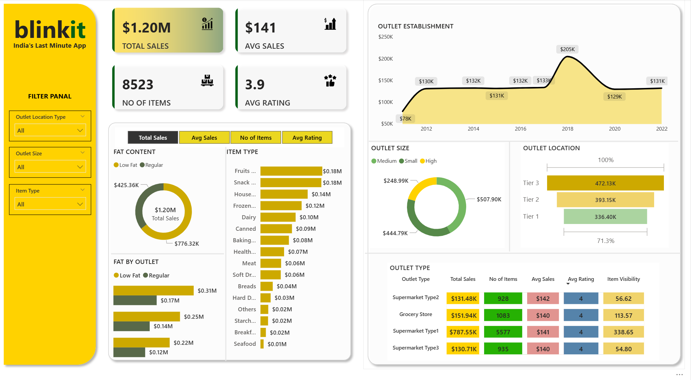

# Power BI Project Collection

---
This repository offers a diverse collection of Power BI dashboards and projects. Each project folder includes the **Power BI dashboard file (.pbix)** and an **image preview** for quick reference.

### Project Overviews

---

### Supermarket

This dashboard provides a comprehensive analysis of supermarket sales data, offering insights into **sales trends** and **product performance**.

---

### ProfitDashboard

An executive-level financial snapshot, this dashboard focuses on **gross profit analysis** and **sales trends**.

---

### KPIDashboard

This KPI drill-down dashboard presents **detailed metrics** and **performance indicators** for in-depth analysis.

---

### RevenueDashboard

A revenue trend analyzer, this dashboard **visualizes revenue growth** and **patterns over time**.

---

### GeoSales

This sales heatmap visualizer uses **geographic data** to display **sales density** and **distribution**.

---

### HumanDev

A global progress insight tool, this dashboard showcases **development indicators** across different regions.

---

### BlinkItSales

This grocery operations intelligence dashboard tracks **sales** and **performance metrics** for BlinkIt.

---

### PrimeVideo

A streaming content analyzer, this dashboard provides insights into **titles, genres**, and **user engagement** on Prime Video.

---
This repository contains a collection of Power BI dashboards and projects. Some of these projects were recreated by following YouTube tutorials for practice purposes, while others are original projects or recreations inspired by the work of others.
